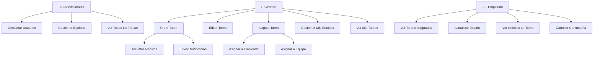
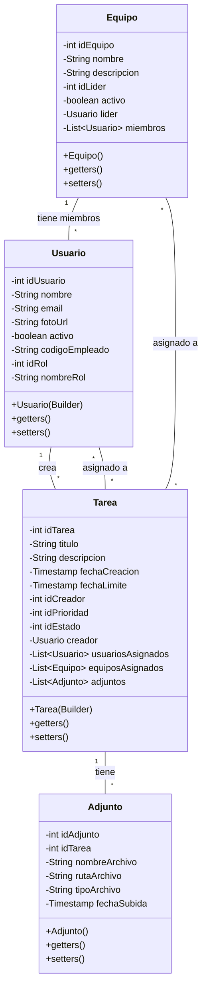
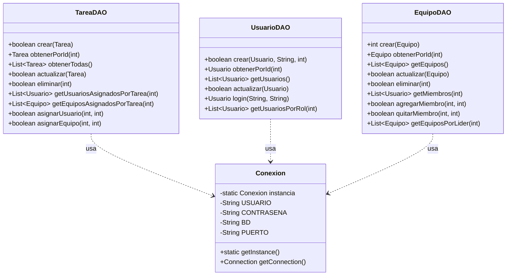
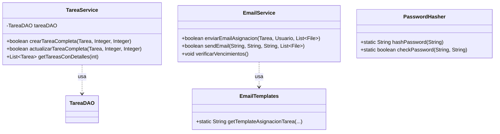
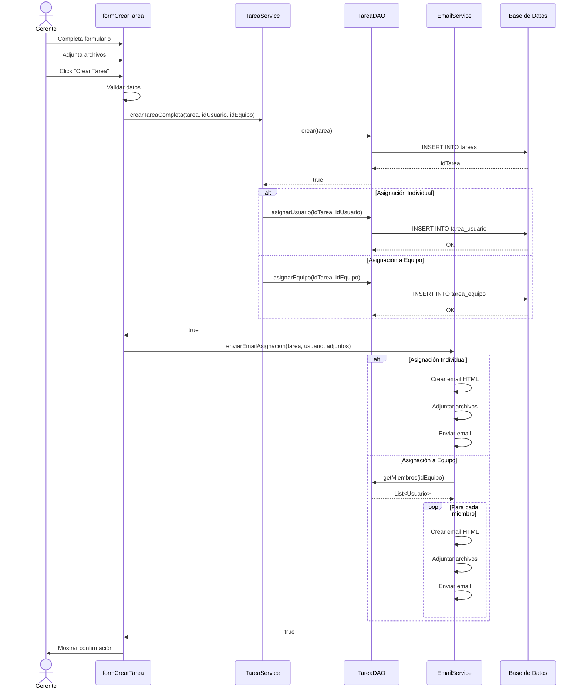
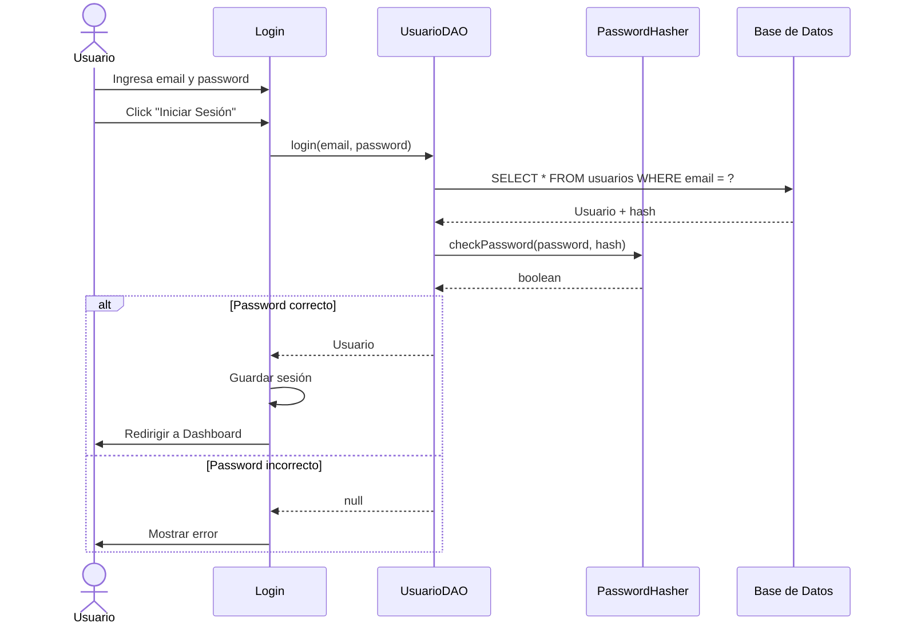
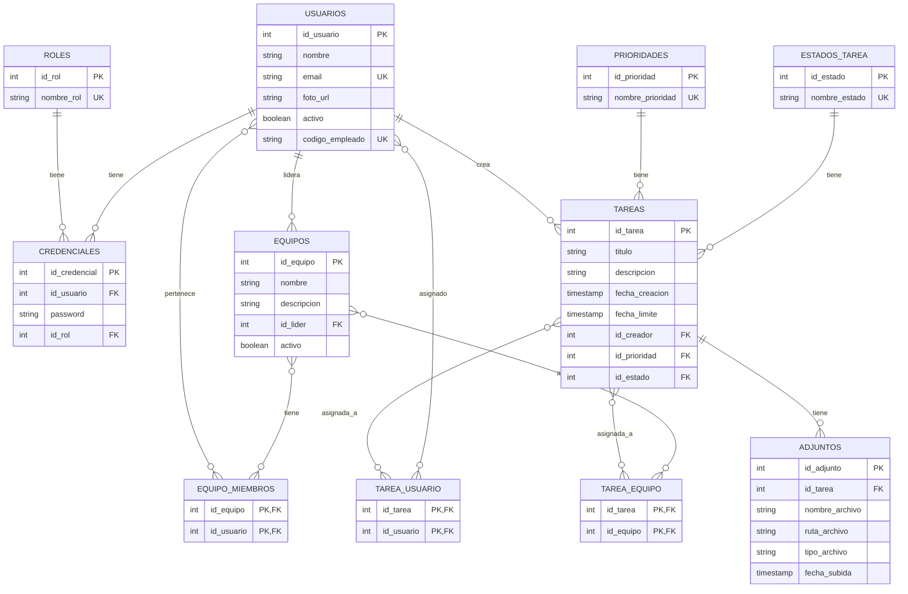
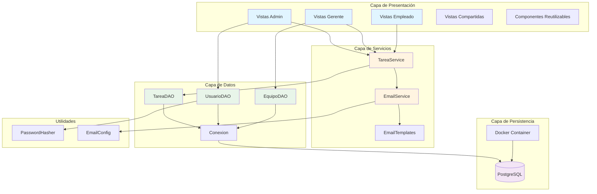

# 📊 Diagramas UML - Sistema Synapse

## Índice

1. [Diagrama de Casos de Uso](#1-diagrama-de-casos-de-uso)
2. [Diagrama de Clases](#2-diagrama-de-clases)
3. [Diagrama de Secuencia](#3-diagrama-de-secuencia)
4. [Diagrama de Base de Datos (ER)](#4-diagrama-de-base-de-datos-er)
5. [Diagrama de Componentes](#5-diagrama-de-componentes)

---

## 1. Diagrama de Casos de Uso

### Actores

- **Administrador**: Gestiona usuarios y equipos
- **Gerente**: Crea tareas y gestiona equipos
- **Empleado**: Gestiona sus tareas asignadas

### Casos de Uso



---

## 2. Diagrama de Clases

### Modelos de Dominio



### Capa DAO



### Servicios



---

## 3. Diagrama de Secuencia

### Crear Tarea y Enviar Notificación



### Login



---

## 4. Diagrama de Base de Datos (ER)



---

## 5. Diagrama de Componentes



---

## Flujos de Datos Principales

### 1. Flujo de Creación de Tarea

```
Gerente → formCrearTarea → TareaService → TareaDAO → PostgreSQL
                ↓
         EmailService → SMTP Server → Usuario(s)
```

### 2. Flujo de Autenticación

```
Usuario → Login → UsuarioDAO → PostgreSQL
                      ↓
              PasswordHasher (BCrypt)
                      ↓
              Dashboard (según rol)
```

### 3. Flujo de Gestión de Equipos

```
Gerente → formMisEquipos → EquipoDAO → PostgreSQL
                ↓
         cardEquipo (componente)
                ↓
         Ver/Editar/Eliminar
```

---

## Patrones de Diseño Utilizados

### 1. Singleton
- **Dónde**: `Conexion.java`
- **Por qué**: Una sola instancia de configuración de BD

### 2. DAO (Data Access Object)
- **Dónde**: `TareaDAO`, `UsuarioDAO`, `EquipoDAO`
- **Por qué**: Separar lógica de acceso a datos

### 3. Builder
- **Dónde**: `Tarea.Builder`
- **Por qué**: Construcción flexible de objetos complejos

### 4. MVC (Model-View-Controller)
- **Dónde**: Toda la aplicación
- **Por qué**: Separación de responsabilidades

### 5. Template Method
- **Dónde**: `EmailTemplates`
- **Por qué**: Plantillas reutilizables de emails

---

## Convenciones de Código

### Nomenclatura

- **Clases**: PascalCase (`TareaService`)
- **Métodos**: camelCase (`crearTarea`)
- **Constantes**: UPPER_SNAKE_CASE (`SMTP_HOST`)
- **Variables**: camelCase (`idUsuario`)

### Estructura de Paquetes

```
com.synapse
├── core          # Núcleo del sistema
├── data          # Acceso a datos
├── ui            # Interfaz de usuario
└── utils         # Utilidades
```

---

**Versión**: 2.0  
**Última actualización**: Noviembre 2025  
**Herramientas**: Mermaid, PlantUML
