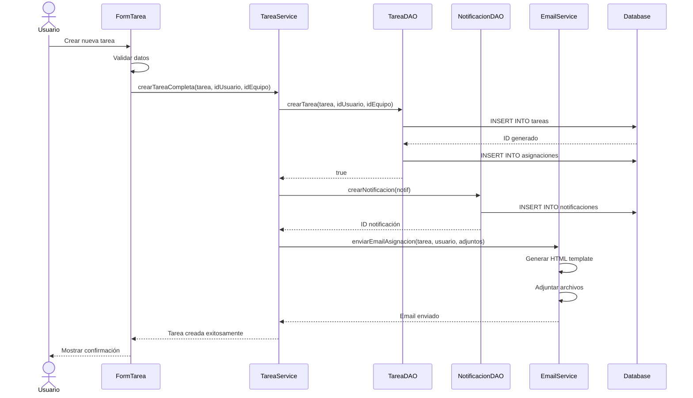
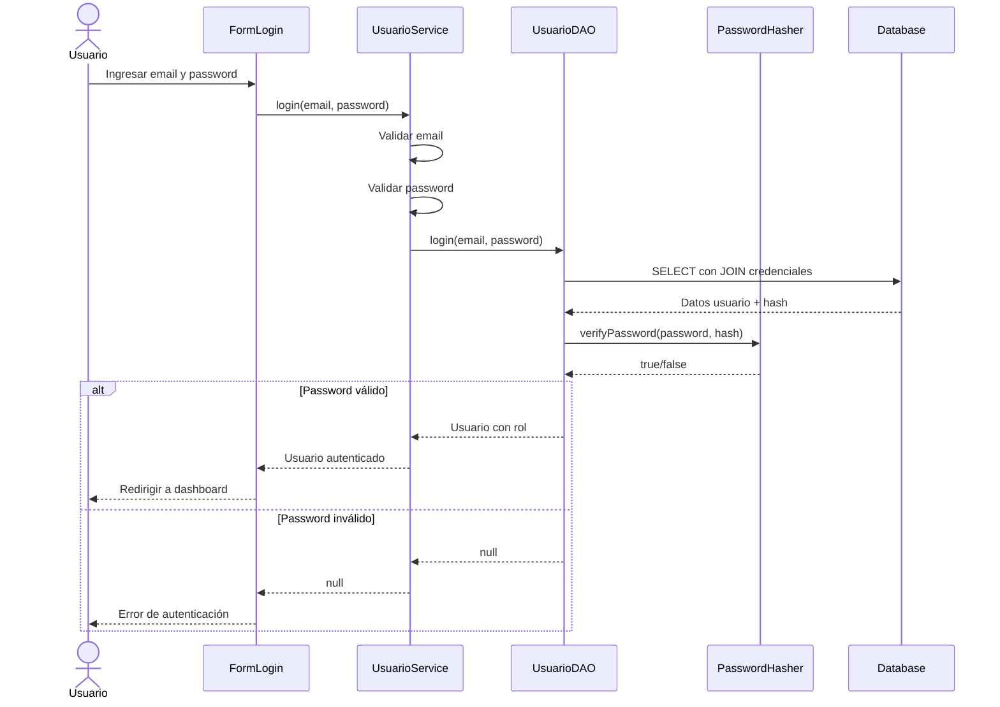
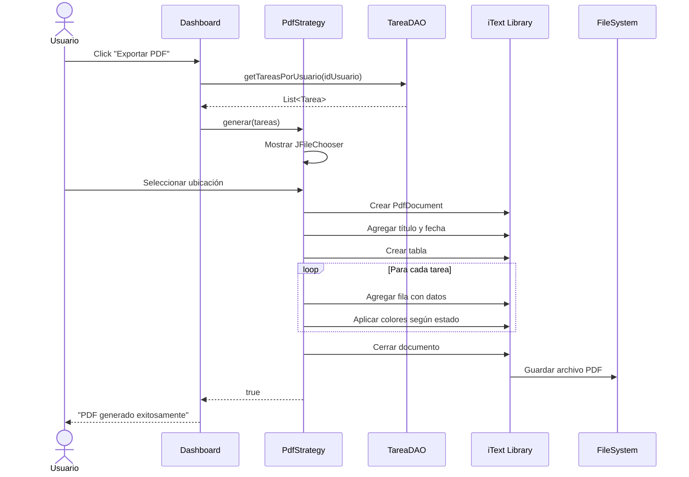
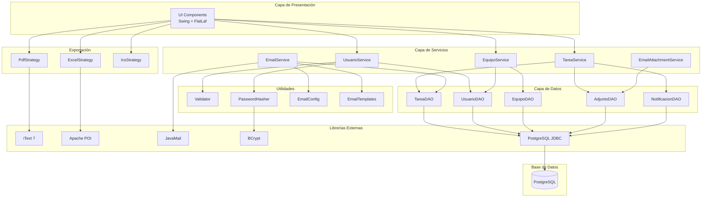
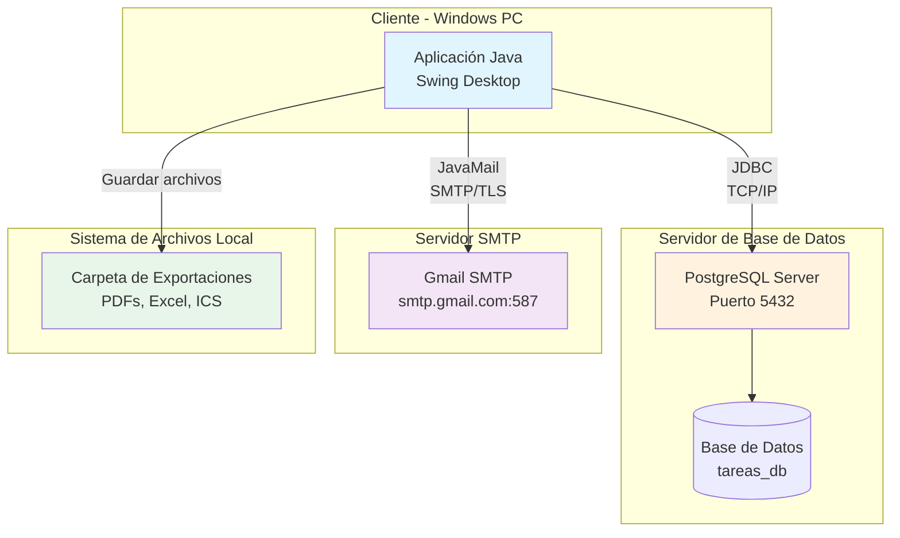

# Diagramas UML - Sistema de Gestión de Tareas

## 📋 Índice

1. [Diagrama de Clases](#diagrama-de-clases)
2. [Diagrama de Secuencia](#diagrama-de-secuencia)
3. [Diagrama de Casos de Uso](#diagrama-de-casos-de-uso)
4. [Diagrama de Componentes](#diagrama-de-componentes)
5. [Diagrama de Despliegue](#diagrama-de-despliegue)

---

## 1. Diagrama de Clases

### 1.1 Diagrama Completo del Sistema

```mermaid
classDiagram
    %% Modelos de Dominio
    class Tarea {
        -int idTarea
        -String titulo
        -String descripcion
        -Date fechaCreacion
        -Date fechaLimite
        -int idEstado
        -int idPrioridad
        -int creadaPor
        -boolean archivada
        +getTitulo() String
        +setTitulo(String)
        +build() Tarea
    }

    class Usuario {
        -int idUsuario
        -String nombre
        -String email
        -String codigoEmpleado
        -String telefono
        -boolean activo
        +getNombre() String
        +getEmail() String
        +setNombre(String)
    }

    class Equipo {
        -int idEquipo
        -String nombre
        -String descripcion
        -int idLider
        -boolean activo
        +getNombre() String
        +getIdLider() int
        +setNombre(String)
    }

    class Adjunto {
        -int idAdjunto
        -int idTarea
        -String nombreArchivo
        -String rutaArchivo
        -String tipoArchivo
        -long tamanioBytes
        -Date fechaSubida
        +getNombreArchivo() String
        +getTamanioBytes() long
    }

    class Notificacion {
        -int idNotificacion
        -int idUsuario
        -int idTarea
        -String mensaje
        -Date fechaCreacion
        -boolean leida
        +getMensaje() String
        +isLeida() boolean
        +marcarComoLeida()
    }

    %% DAOs
    class TareaDAO {
        -Conexion con
        +crearTarea(Tarea, Integer, Integer) boolean
        +getTareaPorId(int) Tarea
        +actualizarTarea(Tarea) boolean
        +eliminarTarea(int) boolean
        +buscarTareas(String) List~Tarea~
        +archivarTarea(int) boolean
        +reasignarTarea(int, Integer, Integer) boolean
    }

    class UsuarioDAO {
        -Conexion con
        +crearUsuario(Usuario, String, int) boolean
        +getUsuarioPorId(int) Usuario
        +actualizarUsuario(Usuario) boolean
        +eliminarUsuario(int) boolean
        +login(String, String) Usuario
        +cambiarPassword(int, String, String) boolean
        +buscarUsuarios(String) List~Usuario~
    }

    class EquipoDAO {
        -Conexion con
        +crearEquipo(Equipo) boolean
        +getEquipoPorId(int) Equipo
        +actualizarEquipo(Equipo) boolean
        +eliminarEquipo(int) boolean
        +agregarMiembro(int, int) boolean
        +removerMiembro(int, int) boolean
        +cambiarLider(int, int) boolean
    }

    %% Servicios
    class TareaService {
        -TareaDAO tareaDAO
        -NotificacionDAO notificacionDAO
        -AdjuntoDAO adjuntoDAO
        +crearTareaCompleta(Tarea, Integer, Integer) boolean
        +modificarTarea(Tarea) boolean
        +archivarTarea(int, String) boolean
        +cambiarEstadoTarea(int, int) boolean
        +reasignarTarea(int, Integer, Integer) boolean
    }

    class UsuarioService {
        -UsuarioDAO usuarioDAO
        +crearUsuarioCompleto(Usuario, String, int) boolean
        +actualizarPerfil(Usuario) boolean
        +cambiarPasswordSeguro(int, String, String) boolean
        +login(String, String) Usuario
        +buscarUsuarios(String) List~Usuario~
    }

    class EquipoService {
        -EquipoDAO equipoDAO
        -UsuarioDAO usuarioDAO
        +crearEquipoCompleto(Equipo, List~Integer~) boolean
        +agregarMiembrosAlEquipo(int, List~Integer~) boolean
        +removerMiembroDelEquipo(int, int) boolean
        +cambiarLider(int, int) boolean
    }

    %% Patrones
    class Conexion {
        -static Conexion instancia
        -Connection conectar
        -Conexion()
        +static getInstance() Conexion
        +getConnection() Connection
    }

    class TaskObserver {
        <<interface>>
        +onTaskDue(List~Tarea~)
    }

    class EmailService {
        -TareaDAO tareaDAO
        +onTaskDue(List~Tarea~)
        +sendEmail(String, String, String, List~File~) boolean
        +enviarEmailAsignacion(Tarea, Usuario, List~File~) boolean
    }

    class IReporteStrategy {
        <<interface>>
        +generar(List~Tarea~) boolean
    }

    class PdfStrategy {
        +generar(List~Tarea~) boolean
    }

    class ExcelStrategy {
        +generar(List~Tarea~) boolean
    }

    %% Relaciones
    TareaDAO --> Tarea : manages
    UsuarioDAO --> Usuario : manages
    EquipoDAO --> Equipo : manages
    
    TareaService --> TareaDAO : uses
    TareaService --> NotificacionDAO : uses
    UsuarioService --> UsuarioDAO : uses
    EquipoService --> EquipoDAO : uses
    EquipoService --> UsuarioDAO : uses
    
    TareaDAO --> Conexion : uses
    UsuarioDAO --> Conexion : uses
    EquipoDAO --> Conexion : uses
    
    EmailService ..|> TaskObserver : implements
    EmailService --> TareaDAO : uses
    
    PdfStrategy ..|> IReporteStrategy : implements
    ExcelStrategy ..|> IReporteStrategy : implements
    
    Tarea "1" -- "*" Adjunto : has
    Usuario "1" -- "*" Notificacion : receives
    Tarea "1" -- "*" Notificacion : generates
```

---

## 2. Diagrama de Secuencia

### 2.1 Crear Tarea Completa

### 2.2 Login de Usuario

### 2.3 Exportar a PDF

---

## 3. Diagrama de Casos de Uso

```mermaid
graph TB
    subgraph "Sistema de Gestión de Tareas"
        UC1[Gestionar Tareas]
        UC2[Gestionar Usuarios]
        UC3[Gestionar Equipos]
        UC4[Enviar Notificaciones]
        UC5[Exportar Reportes]
        UC6[Gestionar Adjuntos]
        
        UC1_1[Crear Tarea]
        UC1_2[Modificar Tarea]
        UC1_3[Eliminar Tarea]
        UC1_4[Archivar Tarea]
        UC1_5[Buscar Tareas]
        UC1_6[Reasignar Tarea]
        
        UC2_1[Crear Usuario]
        UC2_2[Modificar Usuario]
        UC2_3[Eliminar Usuario]
        UC2_4[Cambiar Contraseña]
        UC2_5[Asignar Rol]
        
        UC3_1[Crear Equipo]
        UC3_2[Agregar Miembros]
        UC3_3[Remover Miembros]
        UC3_4[Cambiar Líder]
        
        UC5_1[Exportar PDF]
        UC5_2[Exportar Excel]
        UC5_3[Exportar Calendario]
    end
    
    Admin((Administrador))
    Gerente((Gerente))
    Empleado((Empleado))
    Sistema((Sistema))
    
    Admin --> UC1
    Admin --> UC2
    Admin --> UC3
    Admin --> UC5
    
    Gerente --> UC1
    Gerente --> UC3
    Gerente --> UC5
    
    Empleado --> UC1_2
    Empleado --> UC1_5
    Empleado --> UC5
    
    Sistema --> UC4
    
    UC1 --> UC1_1
    UC1 --> UC1_2
    UC1 --> UC1_3
    UC1 --> UC1_4
    UC1 --> UC1_5
    UC1 --> UC1_6
    
    UC2 --> UC2_1
    UC2 --> UC2_2
    UC2 --> UC2_3
    UC2 --> UC2_4
    UC2 --> UC2_5
    
    UC3 --> UC3_1
    UC3 --> UC3_2
    UC3 --> UC3_3
    UC3 --> UC3_4
    
    UC5 --> UC5_1
    UC5 --> UC5_2
    UC5 --> UC5_3
    
    UC1_1 -.-> UC6
    UC1_1 -.-> UC4
```

---

## 4. Diagrama de Componentes

---

## 5. Diagrama de Despliegue

---

## 6. Descripción de Diagramas

### 6.1 Diagrama de Clases
Muestra la estructura completa del sistema con:
- **Modelos de dominio**: Tarea, Usuario, Equipo, Adjunto, Notificacion
- **DAOs**: Acceso a datos para cada entidad
- **Servicios**: Capa de lógica de negocio (Facade)
- **Patrones**: Singleton (Conexion), Observer (TaskObserver), Strategy (IReporteStrategy)

### 6.2 Diagrama de Secuencia
Ilustra los flujos principales:
- **Crear Tarea**: Orquestación entre servicios, DAOs y notificaciones
- **Login**: Autenticación con hash de contraseñas
- **Exportar PDF**: Generación de reportes con iText

### 6.3 Diagrama de Casos de Uso
Define los actores y sus interacciones:
- **Administrador**: Acceso completo
- **Gerente**: Gestión de tareas y equipos
- **Empleado**: Operaciones básicas
- **Sistema**: Notificaciones automáticas

### 6.4 Diagrama de Componentes
Muestra la arquitectura en capas:
- **Presentación**: UI Swing
- **Servicios**: Lógica de negocio
- **Datos**: DAOs
- **Utilidades**: Validación, seguridad
- **Librerías**: Dependencias externas

### 6.5 Diagrama de Despliegue
Describe la infraestructura:
- **Cliente**: Aplicación desktop Java
- **Servidor BD**: PostgreSQL
- **Servidor SMTP**: Gmail
- **Sistema de archivos**: Exportaciones locales

---

## 7. Notas de Implementación

### Patrones Identificados en los Diagramas

1. **Singleton**: Conexion (una sola instancia de conexión)
2. **Builder**: Tarea.Builder (construcción flexible)
3. **Observer**: TaskObserver → EmailService (notificaciones)
4. **Strategy**: IReporteStrategy → PDF/Excel/ICS (exportación)
5. **Facade**: TareaService, UsuarioService (simplificación)

### Tecnologías Clave

- **Frontend**: Java Swing + FlatLaf
- **Backend**: Java 8+
- **Base de Datos**: PostgreSQL 12+
- **Librerías**: iText 7, Apache POI, JavaMail, BCrypt
