# 📊 Diagramas UML - Sistema Synapse

## Índice

1. [Diagrama de Casos de Uso](#1-diagrama-de-casos-de-uso)
2. [Diagrama de Clases](#2-diagrama-de-clases)
3. [Diagrama de Secuencia](#3-diagrama-de-secuencia)
4. [Diagrama de Base de Datos (ER)](#4-diagrama-de-base-de-datos-er)
5. [Diagrama de Componentes](#5-diagrama-de-componentes)

---

## 1. Diagrama de Casos de Uso

### Actores

- **Administrador**: Gestiona usuarios y equipos
- **Gerente**: Crea tareas y gestiona equipos
- **Empleado**: Gestiona sus tareas asignadas

### Casos de Uso

```mermaid
graph TB
    Admin[👨‍💼 Administrador]
    Gerente[👔 Gerente]
    Empleado[👨‍💻 Empleado]
    
    Admin --> CU1[Gestionar Usuarios]
    Admin --> CU2[Gestionar Equipos]
    Admin --> CU3[Ver Todas las Tareas]
    
    Gerente --> CU4[Crear Tarea]
    Gerente --> CU5[Editar Tarea]
    Gerente --> CU6[Asignar Tarea]
    Gerente --> CU7[Gestionar Mis Equipos]
    Gerente --> CU8[Ver Mis Tareas]
    
    Empleado --> CU9[Ver Tareas Asignadas]
    Empleado --> CU10[Actualizar Estado]
    Empleado --> CU11[Ver Detalles de Tarea]
    Empleado --> CU12[Cambiar Contraseña]
    
    CU6 --> CU13[Asignar a Empleado]
    CU6 --> CU14[Asignar a Equipo]
    
    CU4 --> CU15[Adjuntar Archivos]
    CU4 --> CU16[Enviar Notificación]
```



---

## 2. Diagrama de Clases

### Arquitectura Completa del Sistema


### Descripción de Capas

#### 🎯 Capa de Modelos (Domain Layer)
- **Usuario**: Representa un usuario del sistema con sus credenciales y rol
- **Tarea**: Entidad principal que representa una tarea con todos sus atributos
- **Equipo**: Agrupa usuarios bajo un líder para asignaciones grupales
- **Adjunto**: Archivos asociados a una tarea

#### 💾 Capa de Acceso a Datos (DAO Layer)
- **Conexion**: Singleton que gestiona la conexión a PostgreSQL
- **UsuarioDAO**: CRUD completo de usuarios, login y gestión de contraseñas
- **TareaDAO**: Gestión completa de tareas, asignaciones y búsquedas
- **EquipoDAO**: Gestión de equipos y sus miembros

#### ⚙️ Capa de Servicios (Service Layer)
- **EmailService**: Envío de emails con templates HTML
- **EmailTemplates**: Generación de plantillas HTML para diferentes tipos de notificaciones
- **PasswordHasher**: Encriptación y verificación de contraseñas con BCrypt
- **PasswordBuilder**: Generación de contraseñas aleatorias seguras
- **TaskScheduler**: Monitoreo de tareas próximas a vencer (Observer Pattern)

#### 🎨 Capa de Presentación (UI Layer)
- **Vistas**: Dashboards específicos por rol (Admin, Gerente, Empleado)
- **Formularios**: Diálogos para crear/editar usuarios, tareas y equipos
- **Componentes**: Elementos reutilizables (TaskCard, ToggleButton, Pills, etc.)

---

## 3. Diagrama de Secuencia

### Crear Tarea y Enviar Notificación

```mermaid
sequenceDiagram
    actor Gerente
    participant UI as formCrearTarea
    participant TS as TareaService
    participant DAO as TareaDAO
    participant ES as EmailService
    participant BD as Base de Datos
    
    Gerente->>UI: Completa formulario
    Gerente->>UI: Adjunta archivos
    Gerente->>UI: Click "Crear Tarea"
    
    UI->>UI: Validar datos
    UI->>TS: crearTareaCompleta(tarea, idUsuario, idEquipo)
    
    TS->>DAO: crear(tarea)
    DAO->>BD: INSERT INTO tareas
    BD-->>DAO: idTarea
    DAO-->>TS: true
    
    alt Asignación Individual
        TS->>DAO: asignarUsuario(idTarea, idUsuario)
        DAO->>BD: INSERT INTO tarea_usuario
        BD-->>DAO: OK
    else Asignación a Equipo
        TS->>DAO: asignarEquipo(idTarea, idEquipo)
        DAO->>BD: INSERT INTO tarea_equipo
        BD-->>DAO: OK
    end
    
    TS-->>UI: true
    
    UI->>ES: enviarEmailAsignacion(tarea, usuario, adjuntos)
    
    alt Asignación Individual
        ES->>ES: Crear email HTML
        ES->>ES: Adjuntar archivos
        ES->>ES: Enviar email
    else Asignación a Equipo
        ES->>DAO: getMiembros(idEquipo)
        DAO-->>ES: List<Usuario>
        loop Para cada miembro
            ES->>ES: Crear email HTML
            ES->>ES: Adjuntar archivos
            ES->>ES: Enviar email
        end
    end
    
    ES-->>UI: true
    UI->>Gerente: Mostrar confirmación
```



### Login

```mermaid
sequenceDiagram
    actor Usuario
    participant UI as Login
    participant DAO as UsuarioDAO
    participant PH as PasswordHasher
    participant BD as Base de Datos
    
    Usuario->>UI: Ingresa email y password
    Usuario->>UI: Click "Iniciar Sesión"
    
    UI->>DAO: login(email, password)
    DAO->>BD: SELECT * FROM usuarios WHERE email = ?
    BD-->>DAO: Usuario + hash
    
    DAO->>PH: checkPassword(password, hash)
    PH-->>DAO: boolean
    
    alt Password correcto
        DAO-->>UI: Usuario
        UI->>UI: Guardar sesión
        UI->>Usuario: Redirigir a Dashboard
    else Password incorrecto
        DAO-->>UI: null
        UI->>Usuario: Mostrar error
    end
```



---

## 4. Diagrama de Base de Datos (ER)


---

## 5. Diagrama de Componentes

```mermaid
graph TB
    subgraph "Capa de Presentación"
        UI_ADMIN[Vistas Admin]
        UI_GERENTE[Vistas Gerente]
        UI_EMPLEADO[Vistas Empleado]
        UI_SHARED[Vistas Compartidas]
        COMPONENTS[Componentes Reutilizables]
    end
    
    subgraph "Capa de Servicios"
        TAREA_SERVICE[TareaService]
        EMAIL_SERVICE[EmailService]
        EMAIL_TEMPLATES[EmailTemplates]
    end
    
    subgraph "Capa de Datos"
        TAREA_DAO[TareaDAO]
        USUARIO_DAO[UsuarioDAO]
        EQUIPO_DAO[EquipoDAO]
        CONEXION[Conexion]
    end
    
    subgraph "Capa de Persistencia"
        POSTGRES[(PostgreSQL)]
        DOCKER[Docker Container]
    end
    
    subgraph "Utilidades"
        PASSWORD_HASHER[PasswordHasher]
        EMAIL_CONFIG[EmailConfig]
    end
    
    UI_ADMIN --> TAREA_SERVICE
    UI_GERENTE --> TAREA_SERVICE
    UI_EMPLEADO --> TAREA_SERVICE
    
    UI_ADMIN --> USUARIO_DAO
    UI_GERENTE --> EQUIPO_DAO
    
    TAREA_SERVICE --> TAREA_DAO
    TAREA_SERVICE --> EMAIL_SERVICE
    
    EMAIL_SERVICE --> EMAIL_TEMPLATES
    EMAIL_SERVICE --> EMAIL_CONFIG
    
    TAREA_DAO --> CONEXION
    USUARIO_DAO --> CONEXION
    EQUIPO_DAO --> CONEXION
    
    USUARIO_DAO --> PASSWORD_HASHER
    
    CONEXION --> POSTGRES
    DOCKER --> POSTGRES
    
    style UI_ADMIN fill:#e1f5ff
    style UI_GERENTE fill:#e1f5ff
    style UI_EMPLEADO fill:#e1f5ff
    style TAREA_SERVICE fill:#fff4e1
    style EMAIL_SERVICE fill:#fff4e1
    style TAREA_DAO fill:#e8f5e9
    style USUARIO_DAO fill:#e8f5e9
    style EQUIPO_DAO fill:#e8f5e9
    style POSTGRES fill:#f3e5f5
```



---

## Flujos de Datos Principales

### 1. Flujo de Creación de Tarea

```
Gerente → formCrearTarea → TareaService → TareaDAO → PostgreSQL
                ↓
         EmailService → SMTP Server → Usuario(s)
```

### 2. Flujo de Autenticación

```
Usuario → Login → UsuarioDAO → PostgreSQL
                      ↓
              PasswordHasher (BCrypt)
                      ↓
              Dashboard (según rol)
```

### 3. Flujo de Gestión de Equipos

```
Gerente → formMisEquipos → EquipoDAO → PostgreSQL
                ↓
         cardEquipo (componente)
                ↓
         Ver/Editar/Eliminar
```

---

## Patrones de Diseño Utilizados

### 1. Singleton
- **Dónde**: `Conexion.java`
- **Por qué**: Una sola instancia de configuración de BD

### 2. DAO (Data Access Object)
- **Dónde**: `TareaDAO`, `UsuarioDAO`, `EquipoDAO`
- **Por qué**: Separar lógica de acceso a datos

### 3. Builder
- **Dónde**: `Tarea.Builder`
- **Por qué**: Construcción flexible de objetos complejos

### 4. MVC (Model-View-Controller)
- **Dónde**: Toda la aplicación
- **Por qué**: Separación de responsabilidades

### 5. Template Method
- **Dónde**: `EmailTemplates`
- **Por qué**: Plantillas reutilizables de emails

---

## Convenciones de Código

### Nomenclatura

- **Clases**: PascalCase (`TareaService`)
- **Métodos**: camelCase (`crearTarea`)
- **Constantes**: UPPER_SNAKE_CASE (`SMTP_HOST`)
- **Variables**: camelCase (`idUsuario`)

### Estructura de Paquetes

```
com.synapse
├── core          # Núcleo del sistema
├── data          # Acceso a datos
├── ui            # Interfaz de usuario
└── utils         # Utilidades
```

---

**Versión**: 2.0  
**Última actualización**: Noviembre 2025  
**Herramientas**: Mermaid, PlantUML
